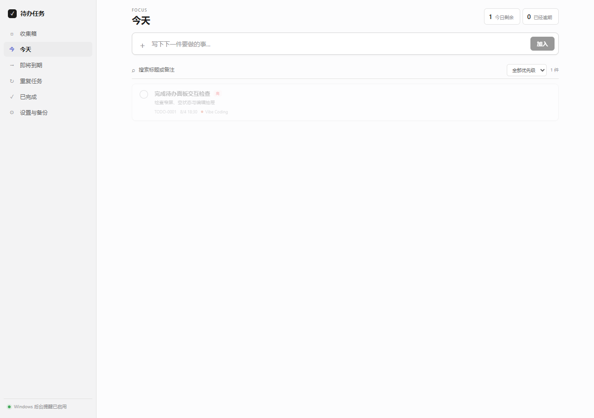

# Codex Todo Reminder（待办任务）

一款独立的本地待办与提醒工具，直接嵌入 Codex Desktop 功能面板。它不依赖现有任务看板，数据保存在自己的本机数据库中。



## 主要能力

- 收集箱、今天、即将到期、重复任务、已完成五个视图
- 到期时间、提醒时间、优先级、备注和清单
- 每日、工作日、每周、每月、每年重复
- Windows 通知，可直接完成或稍后提醒
- Codex 面板自动嵌入，浅色/深色主题自动同步
- 登录后自动启动；后台或连接意外中断后自动恢复
- 每日自动备份、手动备份、导入、导出与一键恢复
- 本机令牌保护，只监听 `127.0.0.1`，不向云端上传数据
- Codex 可通过随附技能用自然语言管理待办

## 系统要求

- Windows 10 或 Windows 11
- 已安装 Codex Desktop
- Node.js 22.16 或更高版本
- Git

## 安装

在 PowerShell 中运行：

```powershell
git clone https://github.com/GodAI-Master/codex-todo-reminder.git
cd codex-todo-reminder
powershell -NoProfile -ExecutionPolicy Bypass -File scripts\install-windows.ps1
```

安装完成后，从桌面或开始菜单的 **Codex** 快捷方式打开。Codex 左侧会出现 **待办任务**。

安装程序会同时完成构建、Windows 通知注册、Codex 技能安装、登录自启动与后台守护配置。可重复运行安装程序进行修复或升级。

## 快速使用

1. 点击 Codex 左侧的 **待办任务**。
2. 在顶部输入事项，可同时设置到期时间、提醒和优先级。
3. 鼠标移到事项上，可完成、稍后提醒或编辑。
4. 在 **设置与备份** 中导出、导入或恢复数据。

也可以直接对 Codex 说：

- “明天下午 3 点提醒我提交周报。”
- “把 TODO-0003 改到下周一上午 10 点。”
- “列出今天未完成的高优先级待办。”
- “将 TODO-0005 标记为完成。”

详细说明见[使用教程](docs/USER_GUIDE_ZH.md)，安装问题见[故障排查](docs/TROUBLESHOOTING_ZH.md)。

## 检查安装

```powershell
powershell -NoProfile -ExecutionPolicy Bypass -File scripts\check-installation.ps1
```

所有项目都显示 `true` 即表示后台、连接、自启动、数据库和 Codex 技能均已就绪。

## 卸载

```powershell
powershell -NoProfile -ExecutionPolicy Bypass -File scripts\uninstall-windows.ps1
```

卸载会移除自启动、后台进程和 Codex 技能，但保留 `%LOCALAPPDATA%\CodexTodoReminder` 中的待办与备份。

## 开发与验证

```powershell
npm install
npm run check
```

项目使用 MIT 许可证。Codex Desktop 的界面结构发生较大升级时，嵌入入口可能需要随版本适配；后台守护和数据不受影响。
