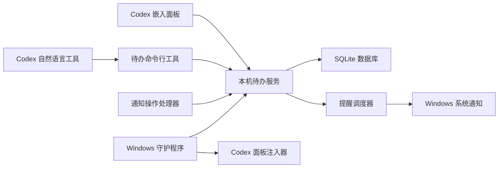

# Codex 待办任务管理与提醒产品设计

**状态：** 已确认  
**日期：** 2026-08-04  
**产品目录：** `D:\CodeX\codex-todo-reminder`

## 1. 产品目标

打造一款与 `dashi-taskboard` 完全独立的本地待办产品。它在 Codex 侧边栏中拥有单独的“待办任务”入口，也能在 Codex 未打开时通过 Windows 系统通知准时提醒。

首版包含：快速新增、收集箱、今天、即将到期、重复任务、完成记录、清单、优先级、截止时间、提醒时间、稍后提醒、搜索筛选、备份恢复，以及 Codex 自然语言操作。

首版不包含：团队协作、云同步、附件、子任务、番茄钟、日历双向同步和移动端。

## 2. 成功标准

- Windows 登录后自动启动，Codex 关闭时仍可提醒。
- 正常运行时，提醒时间误差不超过 30 秒。
- 后台异常退出后 10 秒内恢复。
- Codex 打开、重开或刷新后，侧边栏入口自动出现。
- 面板断线后自动重连，不要求用户手动刷新。
- 休眠、关机或更新期间错过的提醒，在恢复后只补发一次。
- 数据升级不丢失；自动备份可实际恢复。
- 本机其他网页不能直接读写待办数据。

## 3. 总体架构

采用单机模块化架构：一个 Node.js 后台进程同时提供接口、静态页面、提醒调度和事件推送；独立的 PowerShell 守护程序负责启动、健康检查和异常恢复。这样比拆成多个服务更容易安装和维护，同时保持模块边界，未来可以独立替换通知或同步模块。

## 4. 产品界面

### 4.1 主导航

- 收集箱：没有明确日期的事项。
- 今天：今天到期、今天提醒和已经逾期的事项。
- 即将到期：未来事项，按日期分组。
- 重复任务：所有启用重复规则的事项。
- 已完成：完成历史，可恢复。

### 4.2 快速新增

面板顶部始终提供单行快速新增。回车先保存标题，日期、提醒、清单和优先级可随后补充。复杂的自然语言日期不在网页中自行猜测，而由 Codex 工具解析后调用结构化接口，以避免“下周一”“月底”等表达被误解。

### 4.3 通知操作

系统通知提供：完成、10 分钟后提醒、1 小时后提醒。点击正文打开 Codex，并定位到对应待办。如果 Windows 禁止通知，面板显示明确的设置指引，同时保留面板内的逾期标记。

## 5. 数据设计

数据库位置：`%LOCALAPPDATA%\CodexTodoReminder\data\todo.db`。

核心数据表：

- `lists`：清单名称、颜色、排序和归档状态。
- `todos`：标题、备注、清单、优先级、状态、截止时间、提醒偏移、时区、重复规则及软删除时间。
- `occurrences`：每一次实际发生的重复任务，记录计划时间、提醒时间、完成与稍后提醒状态。
- `notification_deliveries`：通知发送账本，用唯一键防止重复弹窗。
- `settings`：时区、默认提醒、补发窗口和界面偏好。
- `schema_migrations`：数据库升级记录。

所有时间保存为 UTC，同时记录创建时区。重复任务使用 RRULE；每个执行实例使用唯一约束 `(todo_id, scheduled_at_utc)`，保证重启后不会重复生成。

## 6. 提醒流程

1. 调度器每 15 秒查询已到时间且未发送的实例。
2. 在数据库事务内将实例标记为“已领取”，避免同一提醒被重复处理。
3. 写入通知账本后发送 Windows 通知。
4. 成功后记录发送时间；失败则记录原因并退避重试。
5. 电脑恢复后，原定时间在补发窗口内的提醒立即补发；更早的事项只进入“今天”的遗漏摘要。
6. 用户点击完成或稍后提醒，通知处理器将操作提交到本机接口，界面通过事件流立即更新。

## 7. Codex 嵌入与自然语言能力

注入器连接 Codex 的本机调试入口，为侧边栏添加带唯一标识的“待办任务”入口，并以独立 iframe 加载 `http://127.0.0.1:47831/panel/`。注入过程可重复执行，已有入口时不会再次插入。

新产品拥有独立的 `manage-todos` 技能和 `todoctl` 工具。典型指令：

- “明天下午三点提醒我整理项目总结。”
- “列出今天还没完成的高优先级待办。”
- “把‘提交周报’推迟到下周一上午十点。”
- “完成编号 TODO-104。”

工具先返回解析后的标题和时间，再执行写入；遇到时间含糊时要求确认，不自行猜测。

## 8. 自启动与持续运行

安装程序创建当前用户的 Windows 计划任务 `CodexTodoReminderSupervisor`，在用户登录后启动隐藏守护程序。守护程序每 5 秒检查本机服务；异常时使用退避策略重新启动。它只在检测到 Codex 后运行注入器，不会为了提醒而强制打开 Codex。

为了让常见入口启动的 Codex 都带本机调试能力，安装程序检查桌面和开始菜单快捷方式，先备份再创建兼容启动入口。若现有 Codex 已经以同一调试端口启动，新产品直接附着，不启动第二个 Codex，也不依赖现有任务面板。

## 9. 安全与隐私

- 服务只绑定 `127.0.0.1`，不监听局域网地址。
- 首次安装生成随机本机令牌，保存在当前用户可读的配置目录中。
- 接口校验令牌、`Origin` 和请求内容；iframe 仅允许必要权限。
- SQL 全部使用参数绑定，禁止任意查询接口。
- 删除采用 30 天软删除；彻底清除需要二次确认。
- 日志不记录待办备注和授权令牌。

## 10. 备份与恢复

每天首次运行时调用 SQLite 在线备份，保存到 `%LOCALAPPDATA%\CodexTodoReminder\backups`，保留最近 14 份。备份完成后立即执行完整性检查。恢复流程先备份当前数据库，再从选定副本恢复并重新检查；检查失败时自动回滚。

面板另提供 JSON 导入导出。导入先进行格式校验和预览，不直接覆盖现有数据。

## 11. 关键决策记录

### ADR-001：独立模块化单机应用

**决定：** 使用单个后台应用，内部划分接口、存储、调度、通知和嵌入模块。  
**原因：** 当前是单用户本机产品，拆分服务会增加安装和排障成本。  
**代价：** 后台进程故障会同时影响接口和调度，因此必须由守护程序自动恢复。

### ADR-002：SQLite 本地存储

**决定：** 使用 Node.js 自带 SQLite 能力和 WAL 模式。  
**原因：** 当前电脑已有 Node.js 22.17.1，不需要额外数据库服务。  
**代价：** 暂不适合多设备并发；云同步留到后续产品阶段。

### ADR-003：Windows 通知为主，Codex 面板为管理入口

**决定：** 精确提醒由本机调度器触发 Windows Toast，不依赖 Codex 自动化。  
**原因：** Codex 关闭时仍需提醒。  
**代价：** 需要注册 Windows 通知身份和操作回调，并处理用户关闭通知权限的情况。

### ADR-004：独立注入器，共用已有调试入口

**决定：** 产品自带注入器，但允许附着到已经存在的 Codex 调试端口。  
**原因：** 保持产品独立，同时避免多个工具重复启动 Codex。  
**代价：** Codex 界面升级可能影响定位规则，因此需保留多重定位策略和自动回归测试。

## 12. 已知风险与应对

| 风险 | 应对方式 |
|---|---|
| Codex 更新导致入口消失 | 使用稳定标识、多重定位、定时自检和版本日志 |
| Windows 通知被关闭 | 首次检测权限；面板显示修复指引和未提醒警告 |
| 电脑休眠错过时间 | 恢复时按补发窗口处理，并用发送账本去重 |
| 数据库损坏 | WAL、安全事务、每日备份和恢复前完整性检查 |
| 端口被占用 | 安装时检测固定端口，给出占用进程，不静默换端口 |
| 与其他 Codex 注入工具冲突 | 唯一 DOM 标识、独立样式作用域、禁止修改公共节点结构 |

## 13. 首版验收

只有当自动化测试通过，并完成“强制结束进程、休眠恢复、重启 Codex、禁用通知、恢复备份、与现有任务面板同时运行”六类人工演练后，首版才可以视为可交付。
